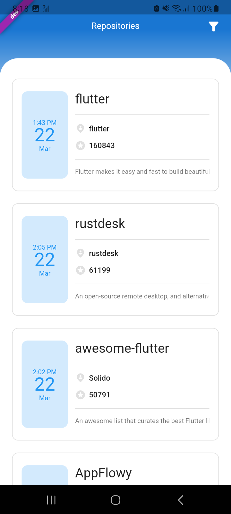

# bs_flutter_task_kawcher

A new Flutter project.

## Getting Started

1. The project has been implemented in clean architecture.
2. For state management i have used Getx
3. For stori

## Screenshots

