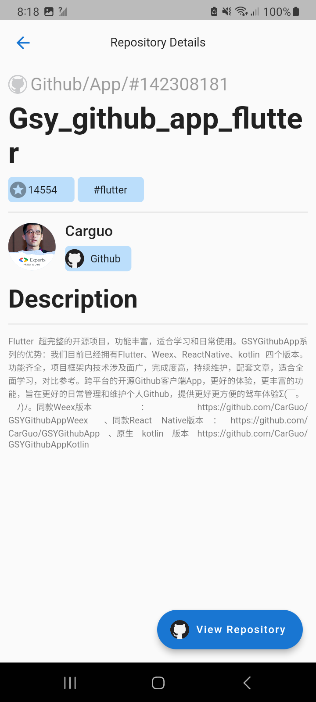

# bs_flutter_task_kawcher

Flutter Task.

## Getting Started

1. The project has been implemented in clean architecture.
2. There are three main layers(data,domain,presentation) to write the code separately.
3. Data layer contains all the remote and local data sources
4. Domain layer is the midman of data and presentation layer which contains business logics
5. presentation layer contains all the ui
6. There are two other directories named Infrastructure directory  which contains helper service classes, navigation management and dependency_injections which contains all the dependencies
7. For state management i have used Getx
8. For storing data locally i have used Sqlite database and get storage for small data

## Screenshots

